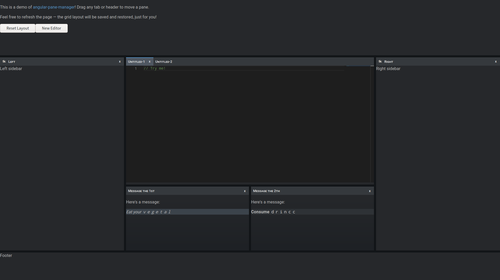

# `angular-pane-manager-example`

There's currently a live demo of this project running [here](https://ryan-s.net/angular-pane-manager/)!



This project shows off a simple example usage of [`angular-pane-manager`] and provides the Angular project scaffolding to build and publish the library.

`app.component.html` and `app.component.ts` show off some basics of the library, such as pane creation and layout save/restore.  `app.component.scss` contains a minimal stylesheet for the pane manager components.

This project was generated with [Angular CLI](https://github.com/angular/angular-cli) version 8.1.0.

## Getting Started

To get up and running for the first time, you will need to pull Git submodules and JS dependencies.  To do this, use the following two commands:

```sh
$ git submodule update --init --recursive
$ yarn install
```

And now, you should be able to run the project with `yarn start`.  If you have the Angular CLI installed, `ng serve` should also work.

The submodule `projects/angular-pane-manager` usually tracks the master branch of [`angular-pane-manager`], but you can verify this by checking the logs as follows:

```sh
$ cd projects/angular-pane-manager
$ git show -q HEAD
```

Git will indicate which branch the current HEAD of the submodule is tracking.

## Further help

To get more help on the Angular CLI use `ng help` or go check out the [Angular CLI README](https://github.com/angular/angular-cli/blob/master/README.md).

[`angular-pane-manager`]: https://github.com/openopus/ng-pane-manager2
